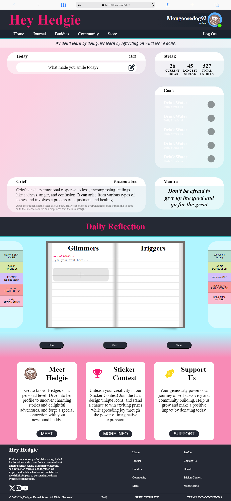

[![Contributors][contributors-shield]][contributors-url]
[![Forks][forks-shield]][forks-url]
[![Stargazers][stars-shield]][stars-url]
[![Issues][issues-shield]][issues-url]
[![MIT License][license-shield]][license-url]

<!-- PROJECT LOGO -->
 

  

<h3 align="center">Hey Hedgie</h3>

    
Embark on a journey of self-discovery, fueled by the whimsical charm. Join a community of kindred spirits, where friendship blossoms, self-reflection thrives, and together, we inspire and hold each other accountable on the delightful path to personal growth and symbolic connections.

    
-Join the community today!

 
 

[//]: # (<h3 font size="1" align="right"><a href="PASTE URL HERE" target="_blank">Visit Site🚀</a></h3>)

## Table of Contents

<!-- TABLE OF CONTENTS -->

  
Table of Contents

  <ol>
    <li><a href="#tech-stack">Tech Stack</a></li>
    <li><a href="#sneak-peek">Sneak Peek</a></li>
    <li><a href="#contact">Contact</a></li>
  </ol>

## Tech Stack

## Sneak Peek

[//]: # (### <a href=" PASTE URL HERE " target="_blank">Visit Site</a> 🚀)

(<a href="#readme-top">back to top</a>)

## Contact Me

<h4>Twitter - <a href="https://twitter.com/ThatZiro">@ThatZiro</a></h4>
<h4>Email - <a href="mailto:ImBrandonBarnes@gmail.com">ImBrandonBarnes@gmail.com</a></h4>
<h4>GitHub - <a href="https://github.com/ThatZiro">ThatZiro</a></h4>
<h4>LinkedIn - <a href="https://www.linkedin.com/in/brandon-barnes-4b2098232/">Brandon Barnes</a></h4>

(<a href="#readme-top">back to top</a>)

<!-- MARKDOWN LINKS & IMAGES -->
<!-- https://www.markdownguide.org/basic-syntax/#reference-style-links -->

[contributors-shield]: https://img.shields.io/github/contributors/ThatZiro/HeyHedgie.svg?style=for-the-badge
[contributors-url]: https://github.com/ThatZiro/HeyHedgie/graphs/contributors
[forks-shield]: https://img.shields.io/github/forks/ThatZiro/HeyHedgie.svg?style=for-the-badge
[forks-url]: https://github.com/ThatZiro/HeyHedgie/network/members
[stars-shield]: https://img.shields.io/github/stars/ThatZiro/HeyHedgie.svg?style=for-the-badge
[stars-url]: https://github.com/ThatZiro/HeyHedgie/stargazers
[issues-shield]: https://img.shields.io/github/issues/ThatZiro/HeyHedgie.svg?style=for-the-badge
[issues-url]: https://github.com/ThatZiro/HeyHedgie/issues
[license-shield]: https://img.shields.io/github/license/ThatZiro/HeyHedgie.svg?style=for-the-badge
[license-url]: https://github.com/ThatZiro/HeyHedgie/blob/master/LICENSE.txt
[linkedin-shield]: https://img.shields.io/badge/-LinkedIn-black.svg?style=for-the-badge&logo=linkedin&colorB=555
[linkedin-url]: https://linkedin.com/in/linkedin_username

